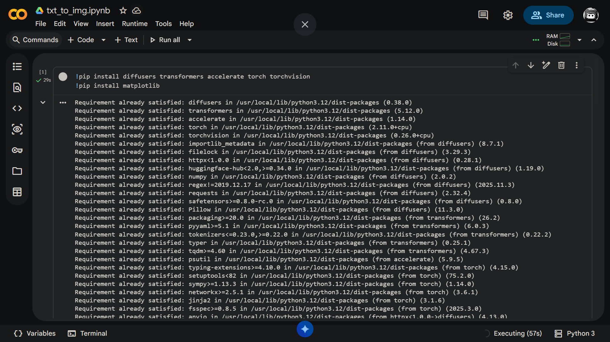
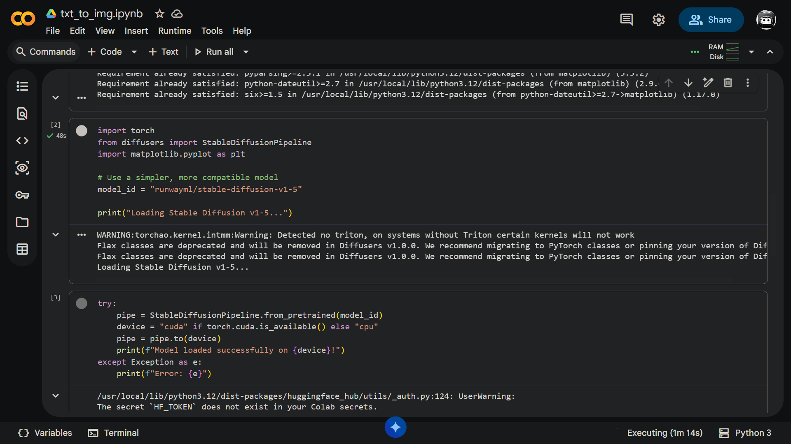
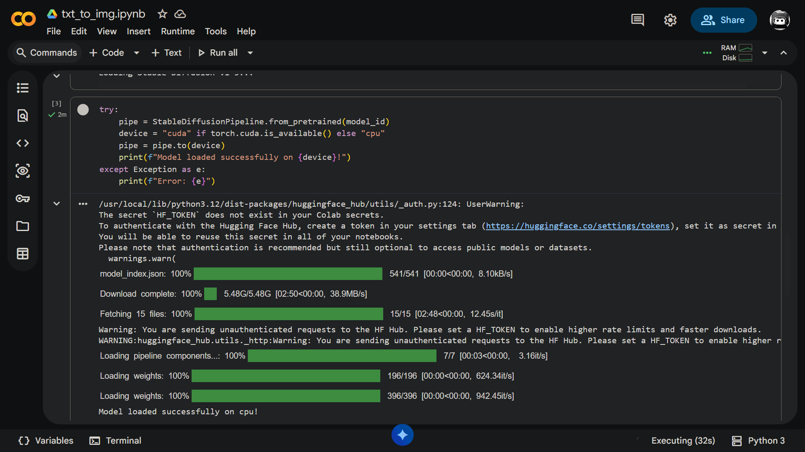
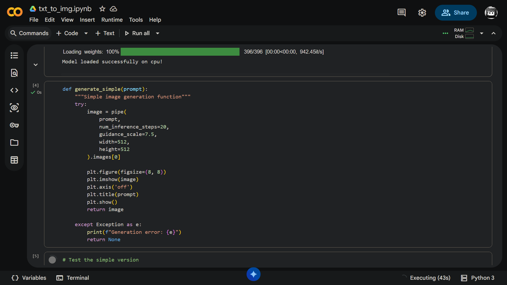
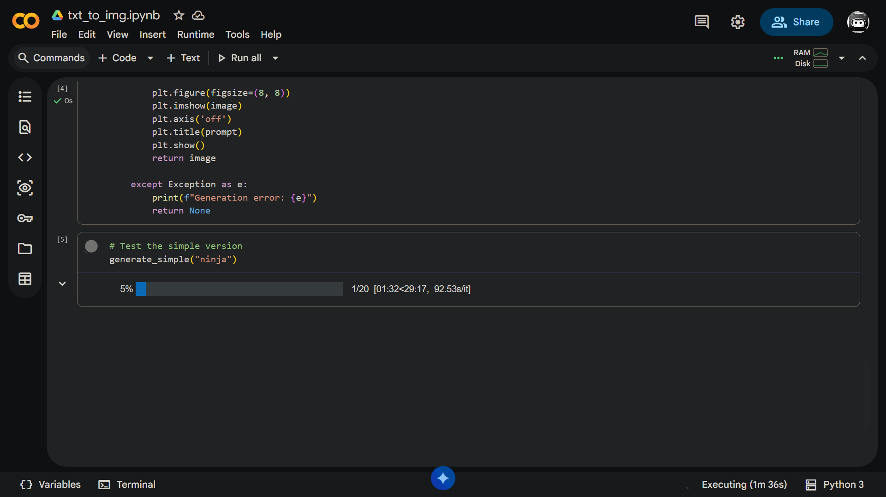
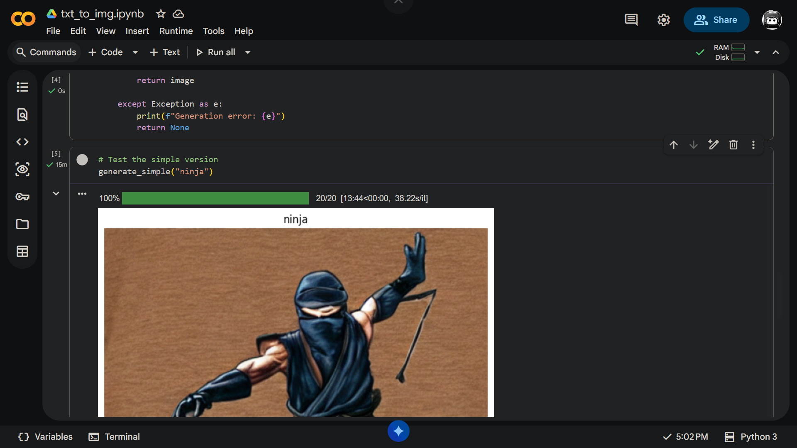

# 🎨 Text-to-Image Generator using Stable Diffusion

A Python-based Text-to-Image Generator built using the **Stable Diffusion v1.5** model from Hugging Face Diffusers. This project converts natural language prompts into AI-generated images.

---

## ✨ Features

- 🖼️ Generate images from text prompts
- 🤖 Uses Stable Diffusion v1.5
- ⚡ Built with PyTorch and Diffusers
- ☁️ Runs easily on Google Colab
- 🎯 Simple and beginner-friendly code

---

## 🛠️ Tech Stack

- Python
- PyTorch
- Hugging Face Diffusers
- Transformers
- Accelerate
- Matplotlib
- Google Colab

---

# 📦 Installation

Install the required dependencies.

```bash
pip install diffusers transformers accelerate torch torchvision
pip install matplotlib
```



---

# 📥 Loading Stable Diffusion Model

The Stable Diffusion v1.5 model is downloaded from Hugging Face and loaded into memory.



---

# ✅ Model Loaded Successfully

After downloading all required files, the pipeline is initialized successfully.



---

# 💻 Image Generation Function

The project defines a simple function that accepts a text prompt and generates an image.



---

# 🚀 Generating an Image

Example prompt:

```python
generate_simple("ninja")
```

The model performs inference to create the image.



---

# 🖼️ Generated Output

Below is the final AI-generated image.



---

# 📁 Project Structure

```
Text-To-Image-Generator/
│
├── README.md
├── txt_to_img.py
├── 01-installation.png
├── 02-model-loading.png
├── 03-model-loaded.png
├── 04-code.png
├── 05-generating.png
└── 06-output.png
```

---

# ▶️ How to Run

Clone the repository:

```bash
git clone https://github.com/YourUsername/Text-To-Image-Generator.git
```

Go into the project directory:

```bash
cd Text-To-Image-Generator
```

Install dependencies:

```bash
pip install -r requirements.txt
```

Run the project:

```bash
python txt_to_img.py
```

---

# 📌 Example Prompt

```python
generate_simple("A futuristic cyberpunk city at night")
```

You can replace the prompt with any description to generate a unique AI image.

---

# 📄 License

This project is intended for educational and learning purposes.

---

## 👨‍💻 Author

**Shivam Rawat**
